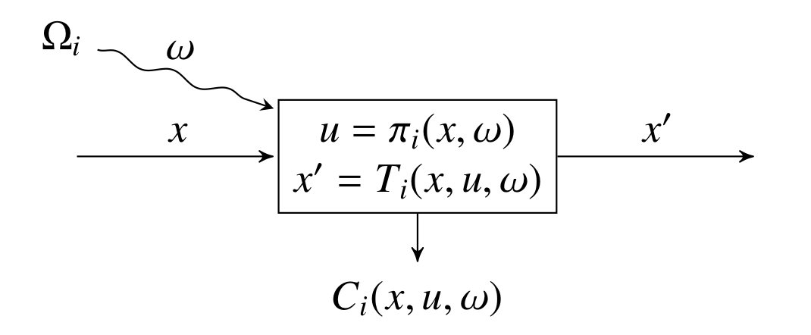
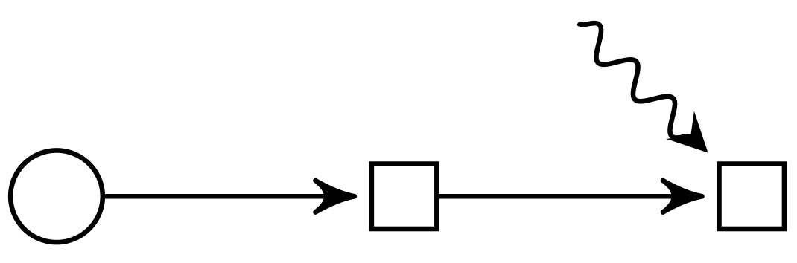

# StochOptFormat: a data structure for multistage stochastic programming

This repository describes a data structure and file-format for stochastic
optimization problems called _StochOptFormat_, with the file extension
`.sof.json`.

For convenience, we sometimes abbreviate StochOptFormat to _SOF_.

StochOptFormat is rigidly defined by the [JSON schema](http://JSON-schema.org)
available at [`https://odow.github.io/StochOptFormat/sof.schema.json`](https://odow.github.io/StochOptFormat/sof.schema.json).

The [examples directory] of the
project's [Github page](https://github.com/odow/StochOptFormat) contains a
pedagogical implementation of Benders decomposition for two stage stochastic
programs in Julia and Python, along with a JSON file for the news-vendor problem
discussed in this documentation. The code is intended to be a guide, rather than
a state-of-the-art implementation.

**Authors**

- [Oscar Dowson](http://github.com/odow) (Northwestern)
- [Joaquim Garcia](http://github.com/joaquimg) (PSR-Inc, PUC-Rio)

_Note: StochOptFormat is in development. Things may change! If you have
suggestions or comments, please [open an issue](https://github.com/odow/StochOptFormat/issues/new)._

### Sections

- [Motivation and design principles](#motivation-and-design-principles)
- [Example](#example)
  - [Vocabulary](#vocabulary)
  - [Graphical representation](#graphical-representation)
  - [Problem in StochOptFormat](#problem-in-stochoptformat)
  - [Explanation](#explanation)
- [Problems, policies, and algorithms](#problems-policies-and-algorithms)
- [FAQ](#faq)
- [Implementations](#implementations)
- [References](#references)

## Motivation and design principles

Libraries of benchmark instances have been instrumental in driving progress in
many areas of optimization. In stochastic programming, some effort has been made
on this front (see, e.g., [https://www.stoprog.org/resources](https://www.stoprog.org/resources)).
However, the predominant file format for these problems, SMPS [4], does not
scale to the types of problems we want to solve (large multistage stochastic
programs), nor does it permit the variety of problem classes we want to study
(e.g., stochastic conic programs).

A more recent attempt to standardize a file format for stochastic programming is
the stochastic extension to OSiL [3]. StochOptFormat utilizes many of the
underlying ideas, but has enough differences to justify the creation of a new
file format. In particular, we use a different standard form for a stochastic
program.

Over the last 4 years, we (and the broader JuMP team) have set about reimagining
how we formulate single period deterministic optimziation problems. The result
is a data structure for optimization called MathOptInterface [2]. In addition,
we have also set about standardizing how we formulate multistage stochastic
programming problems. The result is a natural decomposition of the problem into
the _policy graph_ [1].

**We highly recommend that you do not read further without reading (at minimum)
sections 1, 2, and 3 of [1] and sections 1, 2, 3, and 5 of [2].**

Those papers present the reasoning of behind many aspects of their design, along
with the necessary historical context. However, most of the key ideas can be
grasped from the example in the next section. In particular, the example contains
all the details required to fully describe a two-stage stochastic linear program.

MathOptInterface and the policy graph are synergistic with each other. We can
use the policy graph to describe the high-level structure of a stochastic
program, and we can use MathOptInterface to describe the low-level optimization
problem faced by the agent within each stage (really, node of the policy graph).
Putting these two concepts together leads to a natural data structure for
multistage stochastic programs. StochOptFormat is a serialization of this data
structure into the JSON file format, hence allowing easy access from almost all
major computer languages.

StochOptFormat is inspired by our work on [JuMP] and [SDDP.jl]. However, it is 
not exclusive to Julia or stochastic dual dynamic programming. For example, this 
format makes it possible to read multistage stochastic programming problems into 
Python and solve them with the progressive hedging library [PySP](https://pyomo.readthedocs.io/en/stable/modeling_extensions/pysp.html).
We have not implemented the code yet because this is not our area of expertise.

In creating StochOptFormat, we wanted to achieve the following:

- We wanted a format that is able to scale to problems with hundreds of
  decision periods, state variables, and control variables.
- We wanted a format that was rigidly defined by a schema, so that files could
  be validated for syntactic correctness.
- We wanted a format that was not restricted to linear programming; we want to
  add cones and integrality.
- We wanted a format based on the policy graph so that we can go beyond the
  two-stage realm. Doing so allows us to represent a very large class of problem
  structures, including finite and infinite horizon problems, problems with
  linear stagewise independence, problems with Markovian structure, and problems
  represented by an arbitrary scenario tree.
- We wanted a well-defined notion of what a solution to a stochastic program is.
  (Spoiler alert: it is not the first stage decision. See
  [Problems, policies, and algorithms](#problems-policies-and-algorithms).)

Equally important as the things that we set out to do, is the things that we did
_not_ set out to do.

  - We did not try to incorporate chance constraints.
  - We did not try to incorporate continuous random variables.
  - We did not try to incorporate decision-hazard nodes.

## Example

There are a lot of concepts to unpack in StochOptFormat. We present a two-stage
stochastic linear program example first, and then explain each section of the
corresponding StochOptFormat file in detail.

Consider a two-stage newsvendor problem. In the first stage, the agent chooses
`x`, the number of newspapers to buy at a cost \$1/newspaper. In the second
stage, the uncertain demand of `d` newspapers is realized, and the agent sells
`u` newspapers at a price of \$1.50/newspaper, with the constraint that
`u = min{x, d}`. The demand is either 10 units with probability 0.4, or 14 units
with probability 0.6.

### Vocabulary

Here, we briefly summarize the important terms used by StochOptFormat; we direct
the reader to [1] for more information. Note that some of our terms differ
slightly from [1]. The act of formalizing a data structure has clarified some of
our earlier ideas.

- Nodes

  A policy graph is made up of nodes. Each node corresponds to a point in time
  at which the agent makes a decision.

  In our example, there are two nodes: `first_stage` and `second_stage`.

  For convenience, we also introduce a `root` node, which is not a node at which
  the agent makes a decision, but is just used as a marker for where the agent
  first enters the sequential decision making process. The root node stores the
  initial value for each state variable (see below).

- Edges

  Edges connect two nodes in the policy graph. Each edge has a `from` node, a
  `to` node, and a `probability` of transitioning along the edge. Note that the
  sum of probabilities along outgoing edges of a node does not have to equal 1.
  This allows, for example, discount factors in cyclic graphs and nodes with no
  children, see [1] for more details.

  In our example, there are two edges.
    1. `root` to `first_stage` with probability 1
    2. `first_stage` to `second_stage` with probability 1

- State variables

  State variables are the information in the problem that flows between two
  nodes along an edge. In each node, each stage variable is associated with an
  _incoming_ state variable and an _outgoing_ state variable.

  In our example, there is one state variable, `x`, the number of newspapers
  purchased in the first stage. The _incoming_ state variable of `first_stage`
  represents the initial stock on hand, the _outgoing_ state variable of the
  `first_stage` is equivalent to the _incoming_ state variable of the
  `second_stage`, and the outgoing state variable of the `second_stage` is the
  quantity of unsold newspapers at the end of the second stage.

- Random variables

  Random variables are local to a node, and are assumed to be independent of the
  incoming state variable and the realization of any prior random variables.
  Some nodes may not have any random variables. If so, we say that the node is
  deterministic.

  In our example, the `first_stage` is deterministic, and the `second_stage`
  node has one random variable, `d`, the demand for newspaper.

- Control variables

  Control variables are decisions taken by the agent within a node. They remain
  local to the node, and their values are not needed by the agent in future
  nodes to make a decision.

- Subproblem

  In the policy graph paper [1], the dynamics of the system within each node are
  split into a transition function, a set of feasible controls, and an
  objective. Rather than represent these directly in the file format, we find it
  more convenient to combine these three things in an optimization problem we
  refer to as the _subproblem_.

  The subproblem explicitly excludes the cost-to-go terms, so it is _not_ an
  explicit dynamic programming decomposition. Instead, it is just a structured
  way of communicating the dynamics of each node.

  In addition, incoming state variables, outgoing state variables, and random
  variables are all represented by decision variables in the optimization
  problem. This means that if a random variable is multiplied by a state or
  control variable in a constraint or in the objective, it is represented in
  the subproblem as a quadratic objective or constraint, even if the subproblem
  is linear with the value of the random variable fixed.

  For our example, the first-stage subproblem is:
  ```
  max: -1 * x′
  s.t.      x′ >= 0,
  ```
  and the second-stage subproblem is:
  ```
  max: 1.5 * u
  s.t.       u - x     <= 0
             u     - d <= 0
             u         >= 0.
  ```

### Graphical representation

One strength of the policy graph is that the structure can be easily visualized.
For each node in the graph, we can draw a picture like the following.



Here, `x` is the incoming state variable, `x'` is the outgoing state variable,
`ω` is the random variable observed before making a decision, `u` is the control
variable, `Tᵢ` is transition function, and `Cᵢ` is the stage objective. `πᵢ` is
the decision rule, which maps the incoming state variable `x` and realization of
the random variable `ω` to a feasible control `u`. (The set of feasible controls
`u ∈ Uᵢ(x, ω)` is not shown.)

From this basic building block, we can construct an arbitrary policy graph. Our
example two-stage stochastic program can be visualized as follows:



Here, the first stage is deterministic, then there is a second stage in which
the decision is taken after observing the uncertainty.

We encourage you to read the paper [1] which outlines the full complexity of
problems that can be represented, including problems with Markovian structure
and infinite horizon problems (i.e., cyclic policy graphs).

### Problem in StochOptFormat

Encoded in StochOptFormat, the newsvendor problem becomes:
```json
{
  "author": "Oscar Dowson",
  "name": "newsvendor",
  "date": "2020-07-10",
  "description": "A StochOptFormat implementation of the classical two-stage newsvendor problem.",
  "version": {"major": 0, "minor": 1},
  "root": {
    "name": "root",
    "state_variables": {
      "x": {"initial_value": 0.0}
    }
  },
  "nodes": {
    "first_stage": {
      "state_variables": {
        "x": {"in": "x_in", "out": "x_out"}
      },
      "random_variables": [],
      "subproblem": {
        "version": {"major": 0, "minor": 4},
        "variables": [{"name": "x_in"}, {"name": "x_out"}],
        "objective": {
          "sense": "max",
          "function": {
            "head": "ScalarAffineFunction",
            "terms": [{"variable": "x_out", "coefficient": -1.0}],
            "constant": 0.0
          }
        },
        "constraints": [{
          "function": {"head": "SingleVariable", "variable": "x_out"},
          "set": {"head": "GreaterThan", "lower": 0.0}
        }]
      },
      "realizations": []
    },
    "second_stage": {
      "state_variables": {
        "x": {"in": "x_in", "out": "x_out"}
      },
      "random_variables": ["d"],
      "subproblem": {
        "version": {"major": 0, "minor": 4},
        "variables": [
          {"name": "x_in"}, {"name": "x_out"}, {"name": "u"}, {"name": "d"}
        ],
        "objective": {
          "sense": "max",
          "function": {
            "head": "ScalarAffineFunction",
            "terms": [{"variable": "u", "coefficient": 1.5}],
            "constant": 0.0
          }
        },
        "constraints": [{
          "function": {
            "head": "ScalarAffineFunction",
            "terms": [
              {"variable": "u", "coefficient": 1.0},
              {"variable": "x_in", "coefficient": -1.0}
            ],
            "constant": 0.0
          },
          "set": {"head": "LessThan", "upper": 0.0}
        }, {
          "function": {
            "head": "ScalarAffineFunction",
            "terms": [
              {"variable": "u", "coefficient": 1.0},
              {"variable": "d", "coefficient": -1.0}
            ],
            "constant": 0.0
          },
          "set": {"head": "LessThan", "upper": 0.0}
        }, {
          "function": {"head": "SingleVariable", "variable": "u"},
          "set": {"head": "GreaterThan", "lower": 0.0}
        }]
      },
      "realizations": [
        {"probability": 0.4, "support": {"d": 10.0}},
        {"probability": 0.6, "support": {"d": 14.0}}
      ]
    }
  },
  "edges": [
    {"from": "root", "to": "first_stage", "probability": 1.0},
    {"from": "first_stage", "to": "second_stage", "probability": 1.0}
  ],
  "test_scenarios": [
    [
      {"node": "first_stage", "support": {}},
      {"node": "second_stage", "support": {"d": 10.0}}
    ], [
      {"node": "first_stage", "support": {}},
      {"node": "second_stage", "support": {"d": 14.0}}
    ], [
      {"node": "first_stage", "support": {}},
      {"node": "second_stage", "support": {"d": 9.0}}
    ]
  ],
  "historical_scenarios": [
    [
      {"node": "first_stage", "support": {}},
      {"node": "second_stage", "support": {"d": 10.0}}
    ], [
      {"node": "first_stage", "support": {}},
      {"node": "second_stage", "support": {"d": 14.0}}
    ]
  ]
}
```

### Explanation

A StochOptFormat file is a JSON document. The problem is stored as a single JSON
object. JSON objects are key-value mappings enclosed by curly braces.

The file begins with four self-explanatory optional metadata keys:
`name::String`, `author::String`, `date::String`, and `description::String`.

Note: In the following, `name::String` means that the key of an object is `name`
and the value should be of type `String`. `::List{Object}` means that the type
is a `List`, and elements of the list are `Object`s.

After the optional metadata keys, there are five required keys:

- `version::Object`

  An object describing the minimum version of MathOptFormat needed to parse
  the file. This is included to safeguard against later revisions. It contains
  two keys: `major` and `minor`. These keys should be interpreted using
  [SemVer](https://semver.org).

- `root::Object`

  An object describing the root node of the policy graph. It has two required
  keys:

  - `name::String`

    A unique string name for the root node to distinguish it from other nodes.

  - `state_variables::Object`

    An object describing the state variables in the problem. Each key is the
    unique name of a state variable. The value is an object with one required
    key:

    - `initial_value::Number`

      The value of the state variable at the root node.

- `nodes::Object`

  An object mapping the name of each node of the policy graph (excluding the
  root node) to an object describing the node. Each object has four required
  keys:

  - `state_variables::Object`

    An object that maps the name of each state variable (as defined in the root
    node) to an object describing the incoming and outgoing state variables in
    the subproblem. Each object has two required keys:

    - `in::String`

      The name of the variable representing the incoming state variable in the
      subproblem.

    - `out::String`

      The name of the variable representing the outgoing state variable in the
      subproblem.

  - `random_variables::List{String}`

    A list of strings describing the name of each random variable in the
    subproblem.

  - `subproblem::Object`

    The subproblem corresponding to the node as a MathOptFormat object.

  - `realizations::List{Object}`

    A list of objects describing the finite discrete realizations of the
    stagewise-independent random variable in each node. Each object has two
    required keys:

    - `probability::Number`

      The nominal probability of each realization.

    - `support::Object`

      An object describing the support corresponding to the realization. The
      keys of the object are the random variables declared in
      `random_variables`, and the values are the value of the random variable in
      that realization.

- `edges::List{Object}`

  A list of objects with one element for each edge in the policy graph. Each
  object has three required keys:

  - `from::String`

    The name of the node that the edge exits.

  - `to::String`

    The name of the node that the edge enters. This cannot be the root node.

  - `probability::Number`

    The nominal probability of transitioning from node `from` to node `to`.

- `test_scenarios::List{List{Object}}`

  Scenarios to be used to evaluate a policy. `test_scenarios` is a list,
  containing one element for each scenario in the test set. Each scenario is a
  list of objects. Each object has two required nodes: `node::String` and
  `support::Object`. `node` is the name of the node to visit, and `support` is
  the realization of the random variable at that node. Note that `support` may
  be an _out-of-sample_ realization, that is, one which is not contained in the
  corresponding `realizations` field of the node. Testing a policy is a larger
  topic, so we expand on it in the section [Problems, policies, and algorithms](#problems-policies-and-algorithms).

There is also an optional key, `historical_scenarios::List{List{Object}}`. The
value of the key is identical to `test_scenarios`, except that these scenarios
should be any historical data that was used when first constructing the problem.
This allows modellers to experiment with different representations of the
underlying stochastic process.

In our example, the second stage realizations have probilities of 0.6 and 0.4.
However, there are only two `historical_scenarios`, so one may infer that
another reasonable model would be to give probabilities of 0.5 and 0.5.

Providing both `realizations` and `historical_scenarios` allows us to to do two
things:

1. Solve a model _as formulated by someone else_.
2. Experiment with different formulations of the same sequential decision
  problem using a standard dataset.

For example, we can build a linear policy graph assuming that the random
variables are stagewise independent. However, the historical data may have some
dependence (e.g., autoregressive). Providing historical data allows the modeller
to experiment with different stochastic processes, without corrupting the
testing procedure by using the test scenarios to build the model.

## Problems, policies, and algorithms

Now that we know how problems are represented in StochOptFormat, we need to
introduce some additional vocabulary.

- Problem

  The data structure formulated as a StochOptFormat file. Also called _program_
  or _model_. We standardize on _problem_.

- Policy

  The solution to a deterministic optimization problem is a vector containing
  the primal solution for each decision variable, and possibly a second vector
  containing the dual solution. Both vectors contain a finite number of
  elements.

  In contrast, the solution to a stochastic program is a _policy_. A policy is a
  set of _decision rules_, with one decision rule for each node in the policy
  graph. A decision rule is a function which maps the incoming state variable
  and realization of the random variable at a node to a value for each control
  variable. This function is typically an infinite dimensional object (since,
  e.g., the state variables can be continuous).

- Algorithm

  An algorithm takes a problem as input, and constructs a policy as output.
  Also called _solution method_ or _solver_.

### Evaluating the policy

Comparing two solutions to a determinstic optimization problem is simple: check
the feasibility of each solution, compare objective values, and possibly compare
computation time.

In contrast, comparing two policies is not simple. First, a policy produces a
distribution of outcomes, so ranking two policies requires a user-provided risk
measure based on their risk preference. Moreover, two users may have different
risk preferences, so there is not a uniquely optimal policy.

Second, in many cases the policy is an infinite dimensional object, and the set
of scenarios over which it should be evaluated is so large as to be intractable.

To overcome these two issues, we evaluate the policy by means of an
_out-of-sample_ simulation on a finite discrete set of scenarios provided in the
`test_scenarios` key of a StochOptFormat file.

Solution algorithms should evaluate their policy on each of these scenarios and
report the following for each node in each scenario:

- The objective value of the subproblem excluding any cost-to-go terms.
- The primal solution for all decision variables in the subproblem.
- The dual solution (if one exists) for all constraints in the subproblem.

Solutions should be outputted to a JSON file that conforms to the schema
available at [`https://odow.github.io/StochOptFormat/sof_result.schema.json`](https://odow.github.io/StochOptFormat/sof_result.schema.json).
Most notably, the result file must include the [SHA-256 checksum](https://en.wikipedia.org/wiki/SHA-2)
of the problem file used to generate the policy to ensure that the two files can
be linked.

Evaluating the solution on a finite list of scenarios solves the intractability
problem, but it does not solve the user's risk perference problem. However, with
the above mentioned report, it is possible to evaluate multiple metrics of the
resulting policy, such as expected objective values, and various quantiles.

We envisage that any benchmark library would provide algorithm rankings based on
a number of difference risk measures (e.g., expectation, worst-case, variance),
so that users can select the one that most closely resembles theirs.

We emphasize that the _out-of-sample_ analysis is deeply tied with the actual
application of stochastic optimization in real life.

## FAQ

- Q: The policy graph is too complicated. I just want a format for linear
  T-stage stochastic programs.

  A: The policy graph does take some getting used to. But for a T-stage problem,
  our format requires T subproblems, a list of the state variables, and a
  sequence of edges. Of those things, only the list of edges would be
  superfluous in a purely T-stage format. So, for the sake of a list of objects
  like `{"from": "1", "to": "2", "probability": 1}`, we get a format that
  trivially extends to infinite horizon problems and problems with a stochastic
  process that is not stagewise independent.

- Q: MathOptFormat is too complicated. Why can't we use LP or MPS files?

  A: MathOptFormat can be read and writen by most programming languages. In
  addition, it is very general and easy to extend. Please read Section 2 of [2]
  for more a discussion of the design decisions behind MathOptFormat.

- Q: You don't expect me to write these by hand do you?

  A: No. We expect high-level libraries like [SDDP.jl] to do the reading and 
  writing for you.

- Q: What happened to SMPS?

  A: SMPS is too limiting for multistage problems. We hope to implement a
  converter between SMPS and StochOptFormat at some point... Want to help?

- Q: This seems catered to SDDP; I just have some scenarios.

  A: The policy graph can represent any scenario tree. For more details read
  [1].

- Q: I want continuous random variables.

  A: In this initial version of the format, we only consider finite discrete
  random variables. We might consider adding continuous ones in the future.

- Q: My stochastic process is not stagewise-independent.

  A: Two options: expand the state-space, or create a scenario tree. For more
  information, read Sections 1, 2, and 3 of [1].

- Q: Where are the risk measures?

  A: Risk measures are not part of the problem. They are another input to the
  solution _algorithm_. Put another way, one constructs a risk-averse policy to
  a problem, rather than finding a policy for a risk-averse problem. In
  addition, many solution algorithms (e.g., robust optimization) do not need to
  consider risk measures.

- Q: I don't like JSON.

  A: We're open to better ideas. JSON has universal support in every major
  programming language, and is human-readable(-ish). For now, we choose JSON and
  we will revisit the question if convincing data is presented to show that the
  approach is not viable.

- Q: JSON seems too verbose.

  A: JSON files compress well. For example, for problems in the MIPLIB 2017
  benchmark set, compressed MathOptFormat files are only 37% larger than their
  compressed MPS equivalents [2].

- Q: I want the uncertainty to be an objective/constraint coefficient.

  A: Formulate the objective/constraint as a `ScalarQuadraticFunction`. It's up
  to the reader to infer from the list of the random variables if this is a
  parameterized `ScalarAffineFunction`, or a `ScalarQuadraticFunction` without
  random variables.

- Q: Follow up to the previous question. I want to have `random_variable * x * y`.

  A: Changing the quadratic coefficient matrices in solvers is slow, and doing
  so could easily make the problem non-convex. If you really want to, you could
  add a slack variable (and equality constraint) `z == random_variable * x`, and
  then use `z * y`. If you are in this case, please open an issue; we would like
  to see some real-world examples before proceeding further.

- Q: Why haven't you written an interface to ⟨INSERT LANGUAGE HERE⟩ yet?

  A: Does ⟨INSERT LANGUAGE HERE⟩ have a JSON reader? Just import the file!

## Implementations

- Pedagogical Python code for solving two-stage stochastic linear programs using
  Benders decomposition and [PuLP] is available in the [examples directory].

- Pedagogical Julia code for solving two-stage stochastic linear programs using
  Benders decomposition and [JuMP] is available in the [examples directory].

- Experimental support for reading and writing StochOptFormat files is available 
  in the [SDDP.jl] libary.

## References

[1] Dowson, O. (2020). The policy graph decomposition of multistage stochastic
  programming problems. Networks, 71(1), 3-23.
  [doi: 10.1002/net.21932](https://onlinelibrary.wiley.com/doi/full/10.1002/net.21932)
  [[preprint]](http://www.optimization-online.org/DB_HTML/2018/11/6914.html)

[2] Legat, B., Dowson, O., Garcia, J.D., Lubin, M. (2020). MathOptInterface: a
  data structure for mathematical optimization problems.
  [[preprint]](http://www.optimization-online.org/DB_HTML/2020/02/7609.html)
  [[repository]](https://github.com/jump-dev/MathOptFormat)

[3] Fourer, R., Gassmann, H.I., Ma, J. et al. An XML-based schema for stochastic
  programs. Ann Oper Res 166, 313 (2009).
  [doi:10.1007/s10479-008-0419-x](https://doi.org/10.1007/s10479-008-0419-x)

[4] Gassmann, H. I., & Kristjánsson, B. (2008). The SMPS format explained. IMA
  journal of management mathematics, 19(4), 347-377. [doi: 10.1093/imaman/dpm007](http://maximal.net/resources/GassmannKristjansson_dpm007v1.pdf)


[examples directory]: https://github.com/odow/StochOptFormat/tree/master/examples
[JuMP]: https://jump.dev
[PuLP]: https://coin-or.github.io/pulp/
[SDDP.jl]: https://odow.github.io/SDDP.jl/latest
